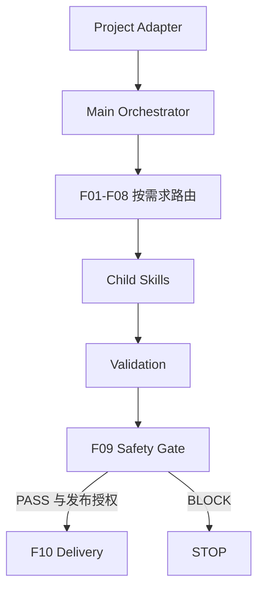

# GitHub Project Showcase

一个面向 Agent 的 GitHub 项目展示编排 Skill：分析项目事实，按需求路由专业子 Skill，生成 README、架构图、流程图、视觉、Demo、安全审查与发布包，并对代码项目执行 fresh-clone 可部署验证。

```text
Status: Generic V0.2 Preview
Design: Verified
Usage: Verified on 3 project shapes
Generated code-project deployability: Verified (one recorded case)
Self-contained child-skill bundle: Verified on fresh Hello CLI fixture (20 entities)
Remote publish backend: Host dependent; local package verified
```

这是产品化开发版本。20 个子实体已固定版本随包，外部运行时仍需安装或探测；Hello CLI 的独立 Fresh Agent E2E 已通过；可选媒体能力与远端写后端仍取决于宿主，尚未提升为稳定版。

## 为什么需要它

普通 Agent 整理项目时，容易只总结 README、画出脱离事实的图、编造数字、泄漏秘密、只交文档而漏掉源码，或把 push 成功当成发布验收。本 Skill 用项目契约、真实子能力调用、产物验证和发布安全闸处理这些问题。

## 架构



## 十个阶段与当前选型

| Phase | 职责 | Primary / Compose | Fallback |
|---|---|---|---|
| F01 | 事实取证 | codebase-knowledge-builder | wtfismyrepo |
| F02 | 叙事 | humanizer | writing-clearly-and-concisely |
| F03 | 架构 | c4-architecture + mermaid-skill | —（无许可证候选已移除） |
| F04 | 流程 | ux-flow-designer | pretty-mermaid |
| F05 | 数据 | strategy-consulting-visualization | tufte-claude-skill |
| F06 | 视觉 | snap-x + og-image-design QA | og-image-generator |
| F07 | 演示 | video-editing / ffmpeg | record |
| F08 | 文档 | readme-skill | good-readme |
| F09 | 安全 | secret-scanner | polish-repo |
| F10 | 交付 | gated Git project archive / host backend | skill-creator（仅 Skill 包） |

选型来自既有本地验证记录；每个子能力的历史验证范围不同，不能据此声称所有 fallback 都已完成真实切换。完整运行绑定仍在产品化，见 [运行状态](manifests/preview-runtime-status.md)。

## 项目适配

从 [SKILL.md](SKILL.md) 和 [项目契约](references/project-contract.md) 开始。Adapter 把事实来源、公开叙事、架构、流程、指标、演示和发布策略交给编排器。缺数据就跳过或如实声明，不能编造。用 [模板](adapters/template/adapter.md) 填写你自己的输入。

- [知识库示例](adapters/examples/knowledge-base/adapter.md)：多知识域与叙事边界。
- [设计示例](adapters/examples/dy/adapter.md)：设计不能表述为已实现；无数据、无 demo 时不路由相应阶段。
- [代码示例](adapters/examples/local-codebase-mcp/adapter.md)：源码随包、排除凭据、独立安装与测试。

示例已重新写成可移植模板，原项目源码和私有事实未包含。

## 验证证据

截至 2026-10-01，维护者本地记录验证了三种项目形态：知识库（含 STOP）、纯设计（含无指标/无 demo 路由）、真实 MCP 工程。MCP 生成包在全新本地 clone 中安装 runtime 依赖、通过 `server.py --check`，另装 `pytest==9.1.1` 后 **326 tests passed**；6 个需要真实语言服务器的测试被排除。

这是对一个生成项目包的历史实测，不是本 Skill 仓库已完成 fresh-clone E2E。原始私有 trace 不随本 Preview 发布。

## 当前缺口

- 20 个子实体已 vendored、hash-locked，逐文件许可证和本地修改记录随包；Fresh Agent E2E 已通过，范围见 [验收摘要](docs/verification.md)。
- F03 无许可证候选已移除，不作为运行依赖。
- GitHub Connector 优先、gh fallback 的后端适配与远端回读仍待产品化。
- 外部 Python / Node / ffmpeg 等需要 doctor 探测；本仓不含这些二进制。
- 运行依赖与验证依赖已在开发分支拆分；Hello CLI fresh-clone E2E 已通过，完整结果与限制见 [验收摘要](docs/verification.md)。

见 [路线图](docs/roadmap.md)、[路由](docs/routing.md) 和 [安全边界](docs/security.md)。

## 许可

第三方实体保留各自上游许可证，见 [THIRD_PARTY_NOTICES.md](THIRD_PARTY_NOTICES.md)；其中有 MIT、Apache-2.0、GPL-3.0 和逐文件 CC-BY-SA-4.0。本项目自有内容采用维护者选定的 [MIT License](LICENSE)。该许可证不覆盖未随包的第三方子 Skill。

## 开发分支运行检查

```sh
python scripts/verify-vendors.py
python scripts/doctor.py
npm ci --ignore-scripts --cache .cache/npm
node scripts/snap-x.mjs --version
python -m unittest discover -s tests -v
```

Markdown YAML adapter 与 skill-creator 的打包校验需要 PyYAML。按自己的项目 Python 环境安装 `requirements-verification.txt`；不要改变全局 Python。主入口仍是 `SKILL.md`，没有一个替代 Agent 的全自动命令。doctor 的 AVAILABLE 只表示依赖在场，不表示产物已验证。

C4 图使用固定 Mermaid CLI 11.17.0 与 Puppeteer 25.12.0。将 `PUPPETEER_CACHE_DIR` 设置为本 checkout 的 `.cache/puppeteer`，运行 `node node_modules/puppeteer/install.mjs` 后使用 `node scripts/render-c4.mjs -i source.mmd -o output.svg`。所有 npm cache 也放 checkout `.cache`。Node 要求 >=24；Snap-X 固定 0.2.1，Windows 文件加载由本地兼容 hook 处理。`satori` 的 `fflate` 覆盖到 0.7.5 修复已确认的审计问题。
