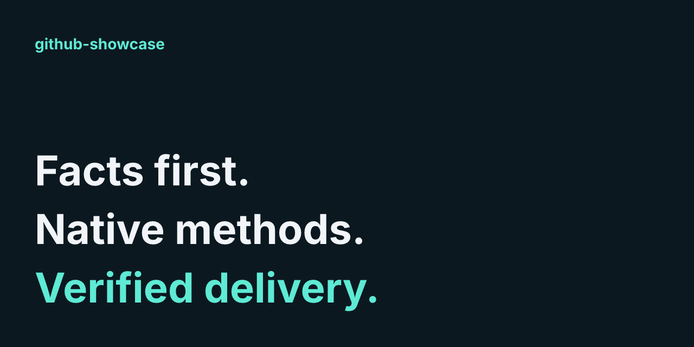
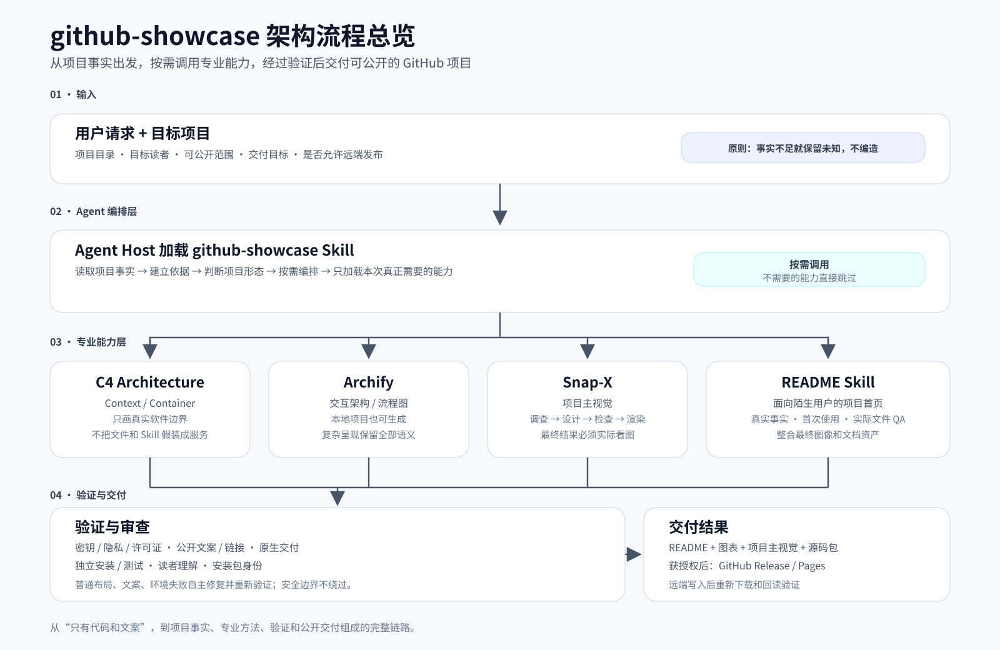

<p align="center">
  
</p>

<h1 align="center">github-showcase</h1>

<p align="center"><strong>把一个本地项目，整理成陌生人看得懂、装得上、跑得通的 GitHub 项目。</strong></p>

<p align="center">Agent 读取真实源码，按需生成 README、架构图、流程图和项目视觉，<br>并在发布前验证安装、链接、隐私、许可证与最终交付。</p>

<p align="center">
  <a href="https://github.com/qq2743759880/github-showcase/releases/download/v1.0.0-rc3/github-showcase-v1.0.0-rc3.zip">下载 RC3</a> · <a href="https://qq2743759880.github.io/github-showcase/">在线交互图</a> · <a href="./SKILL.md">查看 Skill</a>
</p>

## 为什么需要它

项目已经做出来了，别人却不知道为什么要用、怎么安装、第一步该做什么。你可能正遇到这些问题：

- README 还是半成品，功能说明跟不上真实代码。
- 代码在你本机能跑，陌生人却不知道怎么安装、怎么验证。
- 想补架构图、流程图和项目主视觉，又不想让 AI 凭空编功能。
- 准备开源，希望发布前检查密钥、隐私、许可证和断链。
- 想让 Agent 把项目交付完，而不只是写一段漂亮文案。

**从“代码能跑，但只能自己看懂”，到“别人能理解、能按说明开始用，也能核对发布结果”。**

普通 README generator 主要把项目变成文案。github-showcase 是 Agent 加载的 Skill：除了编写首页，还会按事实调用专业方法，验证安装与安全，并在获得发布授权后回读 GitHub 的真实结果。

## 它是怎么工作的



你提供**项目目录、目标读者、可公开范围和交付目标**。Agent 先读取事实，再按项目类型和任务选择真正需要的能力；生成的 README、架构图、流程图和主视觉都要经过相应的安全、引用、安装与交付验证。

布局、文案、环境等普通失败由 Agent 自主修复并重新验证；安全边界不绕过。缺少事实就保留未知，不编造功能或数字。远程发布需要明确授权。

[打开完整交互流程图](https://qq2743759880.github.io/github-showcase/diagrams/showcase.html) · [查看总览的可编辑源码](./docs/diagrams/architecture-flow.mmd)

## 你会得到什么

| 你得到什么 | github-showcase 怎么做 |
|---|---|
| **README** | 从真实源码和可验证命令出发，不编造功能和数字 |
| **架构 / 流程图** | 软件边界用 C4，交互图用 Archify；没有对应事实就不画 |
| **项目主视觉** | Snap-X 完成设计、渲染，并实际检查最终图片 |
| **可安装源码包** | 对代码项目，在全新克隆和独立目录验证安装、首次运行与测试 |
| **安全发布** | 检查密钥、隐私、许可证和公开范围，发布后再回读远端 |

没有测量数据，就用能力分类而不编造收益图表；没有真实视频需求，就跳过视频。输出写入新的展示目录，检查记录留在私有目录。

## 快速安装

需要可读文件、可执行命令的 Agent 和 Python。[下载 RC3](https://github.com/qq2743759880/github-showcase/releases/download/v1.0.0-rc3/github-showcase-v1.0.0-rc3.zip)，解压后进入 `github-showcase/`：

```powershell
# 1. 检查当前环境
python scripts/doctor.py

# 2. 需要图像 / 图表时安装锁定依赖（Node.js 24+）
npm ci --no-audit --fund=false

# 3. 验证内置资源
python scripts/verify-vendors.py
```

把完整 `github-showcase` 目录放进 Agent 的 Skill 发现目录，或直接让 Agent 读取其中的 `SKILL.md`。图表渲染还需要 Chrome/Chromium，源码打包需要 Git；浏览器设置、可选依赖和宿主安装细节见[环境说明](./references/portable-runtime.md)与[首次使用说明](./docs/getting-started.md)。

RC3 是 **Pre-release**。安装使用固定版本 ZIP；克隆仓库用于阅读或开发。图片、展示文档和 Pages 配置不用放进 Skill 发现目录。

## 第一次使用

把下面的请求交给已加载 Skill 的 Agent，并填入你的项目目录：

```text
使用 github-showcase，整理我指定的本地项目。
目标读者是第一次接触项目的开发者。
先读取真实源码，核对功能和首次使用命令；按需补架构图、流程图和项目主视觉。
输出到新的独立目录，完成安全、链接、读者理解和源码包验证。
普通失败请自主修复并重新验证，不覆盖未知用户改动。
本次只准备本地结果，不发布到 GitHub。
```

你应得到该任务需要的 README、图表、主视觉、源码包，以及说明哪些内容已验证、哪些仍未知的检查记录。需要发布时，再明确授权目标仓库和公开范围；安装这个 Skill 本身不会启动托管服务。

## 深入了解

| 你想了解什么 | 入口 |
|---|---|
| 系统边界与实际工具进程 | [架构说明和 C4 图](./docs/architecture.md) |
| 完整项目整理流程 | [交互流程](https://qq2743759880.github.io/github-showcase/diagrams/showcase.html) · [静态预览](./docs/diagrams/showcase.svg) · [本地 HTML](./docs/diagrams/showcase.html) · [图的源数据](./docs/diagrams/showcase.json) |
| 授权、发布与远端回读 | [发布说明](./docs/publication.md) |
| 加载、第一次使用与中断恢复 | [使用说明](./docs/getting-started.md) |
| 依赖和环境诊断 | [环境说明](./references/portable-runtime.md) |
| Agent 实际执行的方法 | [Skill 入口](./SKILL.md) |

## 当前验证范围

RC3 已在 Windows + Python 3.14 + Node.js 24 + Chrome 环境完成安装、渲染和远端回读验证。Linux/macOS 和其他 Agent 宿主尚未做同等级实测，目前不宣称跨平台完全验证。

github-showcase 能检查文件、安装和发布链路，但最终业务语义仍需要 Agent 或维护者判断。它不提供跨宿主强制限制、自动密钥修复或性能提升保证。

## 许可证

项目采用 [`MIT`](./LICENSE)。内置方法的许可见[第三方声明](./THIRD_PARTY_NOTICES.md)；交互展示的代码和字体另见[展示资产许可](./licenses/showcase/archify/LICENSE)与[字体 OFL](./licenses/showcase/archify/JetBrainsMono-OFL.txt)。
