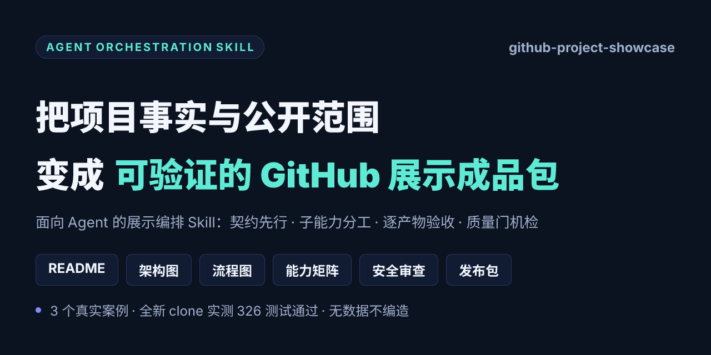
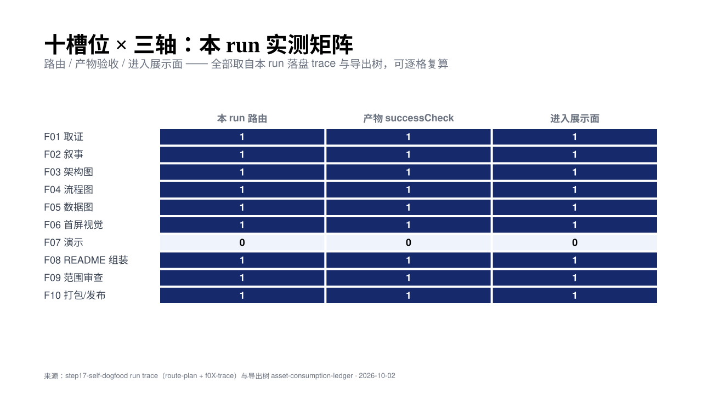

# github-project-showcase

  

**把项目事实与公开范围，变成可验证的 GitHub 展示成品包的编排 Skill。** 面向 Agent：给它一个项目目录、项目事实与公开范围，它编排取证、叙事、架构图、流程图、能力矩阵、首屏视觉、安全审查与本地打包，产出一份可直接用于 GitHub 的展示成品包——每个数字有出处，每条命令被实测，不该公开的进不了包。

三个真实项目已用本方法走完全链：代码项目全新 clone 实测 **326 个测试通过**；纯设计项目如实跳过数据图与演示段；多知识库项目把含凭据的候选文件挡在包外。

## Hero：30 秒三问

| 问题 | 回答 |
|---|---|
| 它是什么 | 面向 Agent 的 GitHub 项目展示**编排** Skill：只做编排，专业能力在 20 件固定版本的子能力实体里 |
| 输入什么 | 项目目录（只读）+ 项目事实（adapter 契约字段，可由 F01 现场取证回填）+ 公开范围（发布授权与审查轴） |
| 输出什么 | README / 架构图 / 流程图 / 能力矩阵 / 首屏视觉 / 安全与范围审查 / 本地发布包 / 代码项目的全新 clone 实测记录 |
| 与普通 README 生成器的区别 | 生成器写文章；本方法交付**可验证**的包：事实纪律 + 逐产物验收 + 四道质量门 + 发布闸 |

## 一句话价值

普通 README 生成器输出一篇文章；本项目把「展示」做成工程链——**数字有出处、图有事实映射、范围有审查、clone 能跑通**，且全程由机检质量门把关，验收标准写在契约里而不是靠感觉。

## 为什么需要它

- **事实纪律**：无证据的数字不写；无指标跳过数据图；无演示素材跳过演示段；设计不得表述为实现（路由级规则，不是口头约定）。
- **能力分工**：十个 phase 槽位（F01 取证 → F10 打包）路由到冻结的子能力实体，每槽有明确调用形态与 successCheck——验不过等于不产出。
- **四道质量门机检**：资产消费门（孤儿资产即失败）、读者理解门（独立 Reviewer 五题）、表层分（README 第一屏禁止维护者信息）、自展示门（SELF_DOGFOOD_PASS 收据）。详见 [docs/security-boundary.md](docs/security-boundary.md)。
- **发布闸**：授权未批准 = 零远程写入，止步 READY_FOR_APPROVAL；范围审查判 BLOCK 的内容，打包面 STOP，不得绕过。
- **源码发布硬规则**：代码项目必须源码随包并在全新 clone 上跑通「装依赖 → 启动检查 → 测试」全链，实测输出写进 trace。

## 工作方式

一切从一份 adapter 契约开始：它把「项目目录、事实源、公开叙事、架构/流程事实、指标、演示素材、发布授权」翻译成标准字段。编排层解析需求 → 路由 phase → 显式加载对应子能力实体 → 逐产物验收 → F08 组装 README（消费全部已验收资产）→ F09 范围审查 → F10 本地打包 → 质量门机检。契约里没填的字段按「无数据」如实声明，禁止编造。

## 架构

图源与逐节点事实映射见 [docs/architecture.md](docs/architecture.md)（可编辑源码 [assets/architecture.mmd](assets/architecture.mmd)）。

## 流程

十步生命周期与代码项目 fresh-clone 支线详见 [docs/workflow.md](docs/workflow.md)（可编辑源码 [assets/workflow-lifecycle.mmd](assets/workflow-lifecycle.mmd)）。

## 真实能力

能力矩阵逐格出处（含 F07=0 的诚实边界）见 [docs/capability-matrix.md](docs/capability-matrix.md)。

## 安装

本仓库是**展示包**（README + docs + assets + Skill 公开投影）。Skill 本体（编排脚本 + 20 件固定版本子能力实体 + 锁定依赖）经独立打包链分发：

1. 获取 Skill 本体包后，在宿主 Agent 中显式加载其 [skill/SKILL.md](skill/SKILL.md)（本包含逐字投影）；
2. 为你的项目从契约模板创建 adapter（字段语义见 [skill/references/project-contract.md](skill/references/project-contract.md)）；
3. 路由权威为 [skill/references/bindings.json](skill/references/bindings.json)——每个 phase 的 PRIMARY/FALLBACK 实体、调用形态与验收标准都在其中；
4. 运行依赖（Node ≥ 24、Python 3）按 Skill 本体包内的安装说明就位；渲染工具全部钉定版本并优先使用项目内缓存。

## 使用示例

| 案例 | 项目形态 | 本方法做了什么 | 结果 |
|---|---|---|---|
| Case 1 · local-codebase-mcp | 真实代码项目 | 源码随包 + 全新 clone 三步实测（装依赖 → 启动检查 → 测试） | **326 passed**，Quick Start 每条命令都被实测过 |
| Case 2 · dy助手 | 纯设计方案 | 无指标 → 跳过数据图；无演示 → 跳过演示段；五道防线守住「设计不冒充实现」 | 包内零编造数字，阻塞态与许可缺口如实声明 |
| Case 3 · 知识库系统 | 复杂多知识库 | 三库总览只画三类真实关系、显式声明「不存在的边」 | 范围审查真实拦下含凭据的候选文件（BLOCK → 打包面 STOP） |

三案例的过程证据与逐项出处见 [docs/cases.md](docs/cases.md)。

## 验证结果

本展示包自身的验证记录（全部命令实测，非声称）：

- 首屏视觉：`check` 零 error → `render` exit 0 → PNG 尺寸机检（1280×640 / 1200×630）→ 目视零空框零遮挡（首渲曾发现简体字形空框，加载简体中文字体后修复重渲）；
- 架构/流程图：钉定版本渲染器实跑 exit 0，渲染输出逐项检查（曾发现图源尾部围栏误生成孤儿节点，修复后复渲通过）；
- 能力矩阵：渲染器 exit 0 + 30 格逐值核对（27 格为 1、3 格为 0）；
- 范围审查：凭据扫描引擎真实扫描导出树 + 首屏违禁模式机检 + 断链机检；
- 打包：导出树独立 git 提交 → 全新目录 clone → 清单一致 + 质量门复跑；
- 收尾质量门：`release-gate` 四门全过（gates 为空），结果 JSON 存档于 [docs/verification/verification-results.md](docs/verification/verification-results.md)。

## 限制

- GitHub 站内实渲染（Mermaid fence、社交卡、OG unfurl）在本地无法预验，发布后需首查。
- 方法依赖宿主 Agent 能力（显式加载 Skill 文件执行）；缺能力 = BLOCKED 上报，不虚构。
- 本展示包含 Skill 的公开投影（SKILL.md / 契约 / 路由权威），但**不含** Skill 可运行本体（编排脚本、子能力实体、锁定依赖）——本体经独立打包链分发；代码项目请参照 Case 1 路线（源码随包 + fresh clone 实测）。
- 「无数据」场景（无指标/无演示/无预核事实）按契约如实声明，本方法不会替你补数据。

## 贡献

欢迎通过 issue 与 pull request 参与：新领域 adapter 模板、子能力实体的替换与升级评估、质量门规则细化。改动请保持「事实有出处、验收有命令」的纪律：凡声称，必须可复算。

## 安全边界

数据流边界（公开成品只消费公开投影与已批准资产）、凭据排除、发布闸与四道质量门的完整说明见 [docs/security-boundary.md](docs/security-boundary.md)。

## 文档导航

| 文档 | 内容 |
|---|---|
| [docs/intro.md](docs/intro.md) | 项目主介绍（900 字内公开投影） |
| [docs/architecture.md](docs/architecture.md) | 架构图源 + 逐节点映射 + 禁边表 |
| [docs/workflow.md](docs/workflow.md) | 一次 run 生命周期 + 代码项目支线 + 三案例路由差异 |
| [docs/capability-matrix.md](docs/capability-matrix.md) | 能力矩阵逐格出处 |
| [docs/cases.md](docs/cases.md) | 三个真实案例（证据指针） |
| [docs/security-boundary.md](docs/security-boundary.md) | 安全与发布边界 |
| [docs/verification/asset-consumption-ledger.md](docs/verification/asset-consumption-ledger.md) | 资产消费台账（phase/producer/artifact/validation/final_consumer/consumed_where） |
| [docs/verification/verification-results.md](docs/verification/verification-results.md) | 本包验证结果实录（含质量门输出） |
| [assets/og.png](assets/og.png) | OG 社交卡（发布时作 og:image 素材） |

## 许可

本项目以 [LICENSE](LICENSE)（MIT）发布。
