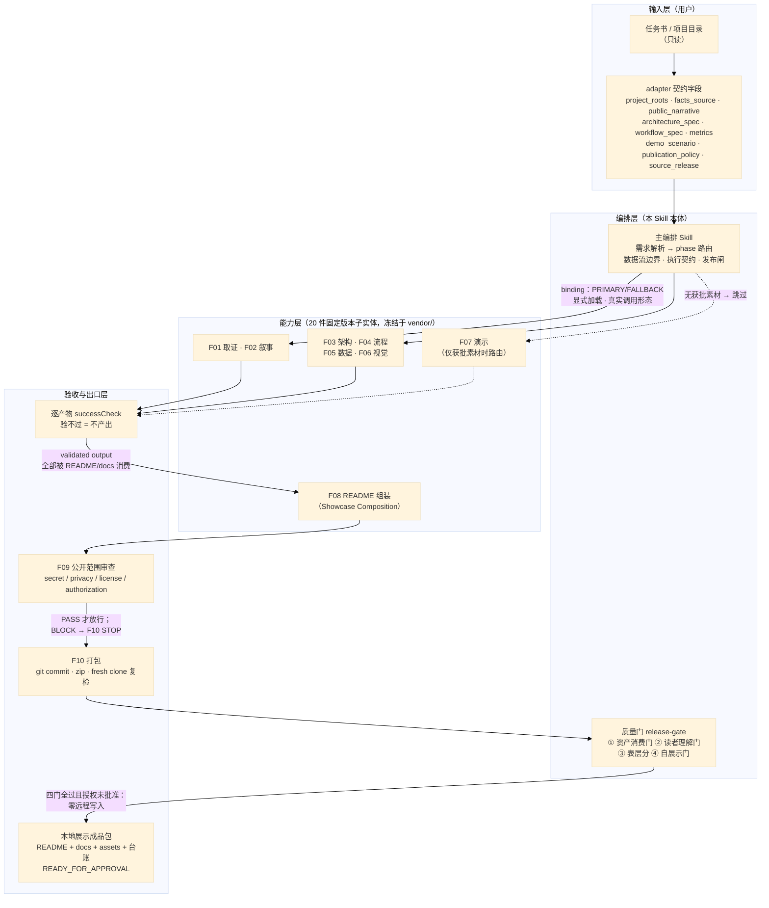

# 架构：契约 → 路由 → 子能力 → 验收 → 消费门 → 发布闸

> F03 产物。渲染成品 [assets/architecture.svg](../assets/architecture.svg)；可编辑图源 [assets/architecture.mmd](../assets/architecture.mmd)（本文末尾同源内嵌）。
> 验收：钉定版本 Mermaid 渲染器实跑 exit 0（首次渲染曾发现图源尾部围栏被误解析为孤儿节点，修复后复渲通过并复检无残留）。

## 图例

- **实线**：真实数据流 / 调用（任务书进契约、契约驱动路由、路由调子能力、产物过验收、组装过审查、打包过质量门）。
- **虚线**：条件路由与门控关系（无获批演示素材 → F07 跳过；四门全过且授权未批准 → 零远程写入的本地包）。

## 逐节点事实映射（每格可回源到 Skill 契约原文）

| 图中节点 | 事实出处（Skill 契约） | 说明 |
|---|---|---|
| 任务书 / 项目目录（只读） | 契约字段 `project_roots[]`（root_type ∈ code/docs/knowledge-base/design/mixed） | 只读取证范围，取证过程不改项目 |
| adapter 契约字段 | 契约字段表：`facts_source / public_narrative / architecture_spec / workflow_spec / metrics / demo_scenario / publication_policy / source_release` | 未填字段=无数据，如实声明禁编造 |
| 主编排 Skill（路由） | 需求解析→phase 路由表（F01-F10）；数据流边界；执行契约五条；发布闸 | 编排层只做编排，不承担专业能力 |
| 冻结子能力实体（20 件） | 绑定权威文件（随包投影 [skill/references/bindings.json](../skill/references/bindings.json)）每槽 PRIMARY/FALLBACK + revision | 固定版本、显式加载、真实调用形态 |
| F01 取证 / F02 叙事 | 无预核事实源 → F01 先行并回填 facts/narrative | 叙事只消费公开投影 |
| F03 架构 / F04 流程 / F05 数据 / F06 视觉 | 渲染类 successCheck：真实渲染器验证、逐值核对、尺寸机检 | F05 仅在指标有证据时路由 |
| F07 演示（仅获批素材时路由） | 演示素材=获批命令子集；不可用则跳过，禁伪造录制 | 三案例中两案即此跳过路径 |
| 逐产物 successCheck | 「validate：逐产物跑 successCheck；验不过=不产出」 | 验收命令与结果全部写 trace |
| F08 README 组装（Showcase Composition） | 必须消费 F02 叙事、F03/F04/F05(若路由)/F06/F07(若路由) 与 F09 边界 | 消费台账随包（[docs/verification/asset-consumption-ledger.md](verification/asset-consumption-ledger.md)） |
| F09 公开范围审查 | secret / privacy / license / authorization 四轴；判 BLOCK 的内容 F10 对其 STOP | 拒绝不得绕过 |
| F10 打包 | 隔离导出树 git 提交 + 压缩包 + 全新 clone 复检；代码项目另有 fresh-clone 硬规则 | 实测输出写 trace |
| 质量门（四门） | 资产消费门 / 读者理解门 / 表层分 / 自展示门，由导出树收尾机检强制 | 任一 FAIL → 不得 READY_FOR_APPROVAL |
| 本地展示成品包 | 授权未批准：零远程写入，止步 READY_FOR_APPROVAL | 「可发布」≠「已发布」 |

## 「不存在的边」禁令（未画出的关系）

| 禁画边 | 理由 |
|---|---|
| 公开成品 → 私有事实源 | 数据流边界：私有事实仅供内部核验，不入公开面 |
| F09 BLOCK → F10 打包 | 安全拒绝（secret/privacy/license/authorization）不得绕过 |
| 编排层 → 远程 GitHub | 授权未批准 = 零远程写入 |
| 任一质量门 FAIL → READY_FOR_APPROVAL | 门是硬闸：FAIL 即停，不存在「带病发布」 |

## 图源（可编辑）

