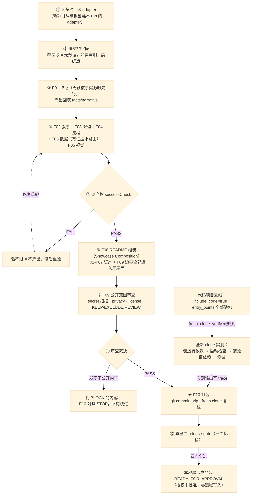

# 一次展示 run 的生命周期

> F04 产物。渲染成品 [assets/workflow-lifecycle.svg](../assets/workflow-lifecycle.svg)；可编辑图源 [assets/workflow-lifecycle.mmd](../assets/workflow-lifecycle.mmd)（文末同源内嵌）。
> 验收：钉定版本 Mermaid 渲染器实跑 exit 0，输出检查通过。

## 步骤与事实映射

| 步骤 | 契约依据 | 产物 / 出口 |
|---|---|---|
| ① 读契约 · 选 adapter | 优先用户提供的 adapter；新项目从模板创建本 run 的 adapter | run 目录（route-plan + trace） |
| ② 填契约字段 | 未填字段 = 无数据，如实声明，禁编造 | adapter；字段语义见 [project-contract.md](../skill/references/project-contract.md) |
| ③ F01 取证 | 无预核事实源 → 先行，产出回填 facts/narrative | 事实文件（逐条带来源与行号） |
| ④ F02-F06 视觉资产 | F05 仅指标有证据时路由；F06 用钉定渲染器 check+render | narrative / 架构图 / 流程图 / 数据图 / Hero |
| ⑤ 逐产物 successCheck | 验不过 = 不产出，修后重验 | validated output |
| ⑥ F08 README 组装 | Showcase Composition：F02-F07 资产 + F09 边界全部进入展示面 | README + docs + 消费台账 |
| ⑦ F09 范围审查 | secret 引擎实扫 + privacy + license + authorization + 人工三分（KEEP/EXCLUDE/REVIEW） | 扫描回执 + 裁决 |
| ⑧ 裁决出口 | PASS → 打包；BLOCK → 打包面 STOP，不得绕过 | 裁决记录 |
| ⑨ F10 打包 | 导出树 git 提交 + 压缩包 + 全新 clone 复检（清单一致 + 质量门复跑） | 本地包 + 复检记录 |
| ⑩ 质量门 | 四门机检：资产消费 / 读者理解 / 表层分 / 自展示 | gates 为空 → READY_FOR_APPROVAL |

## 代码项目支线（fresh clone 硬规则）

项目形态含可运行代码时，`source_release.include_code` 必须为 true，且 READY_FOR_APPROVAL 前必须在**全新 clone** 上跑通全链：

1. 装运行依赖 → 2. 配置准备（不携带维护者私有配置）→ 3. 启动检查 → 4. 装验证依赖（测试依赖与生产依赖分开）→ 5. 测试/验收命令。

实测输出写进 trace；README Quick Start 引用的每个文件、每条命令都必须在包内存在且被这样验证过。案例见 [cases.md](cases.md) Case 1。

## 三案例路由差异（同一方法，不同项目形态）

| phase | Case 1 代码项目 | Case 2 设计项目 | Case 3 多知识库 |
|---|---|---|---|
| F01 取证 | RUN（现场取证） | RUN（结论：纯设计、零实现证据） | SKIP（预核事实已冻结） |
| F05 数据图 | RUN（15 工具 / 9 模块 / 25 测试文件，全部回源计数） | **不路由**（无量化数据，禁编造） | RUN（规模图表，真实数字） |
| F07 演示 | 按素材与验收清单决定 | **不路由**（无获批素材） | 不路由（公开入口未获批） |
| F10 fresh clone | 实测 326 测试通过 | 不适用（无可运行程序，如实声明） | 不适用（纯知识库） |

## 图源（可编辑）

